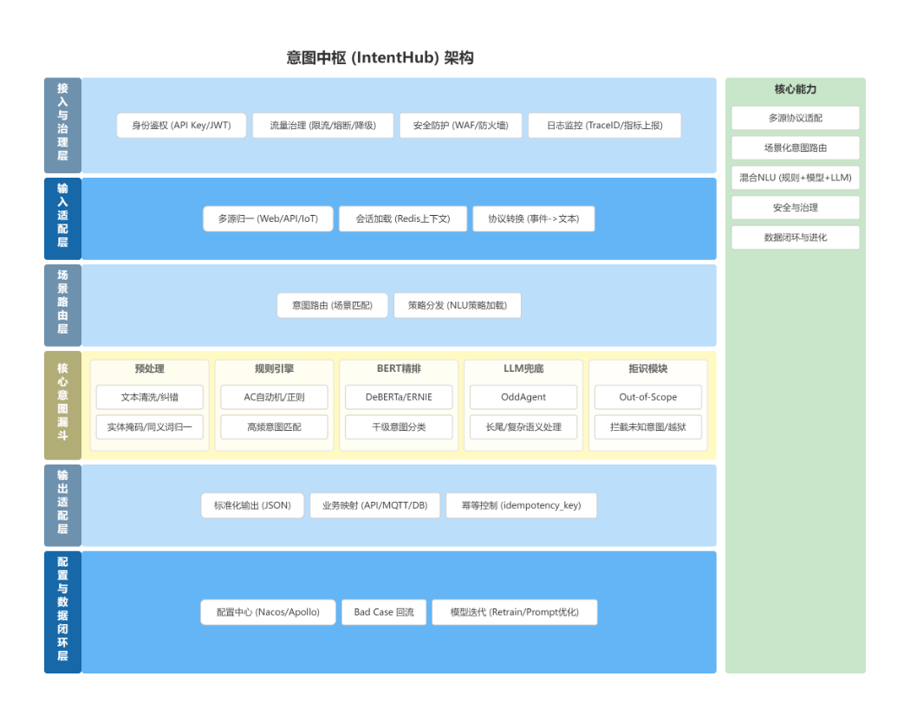
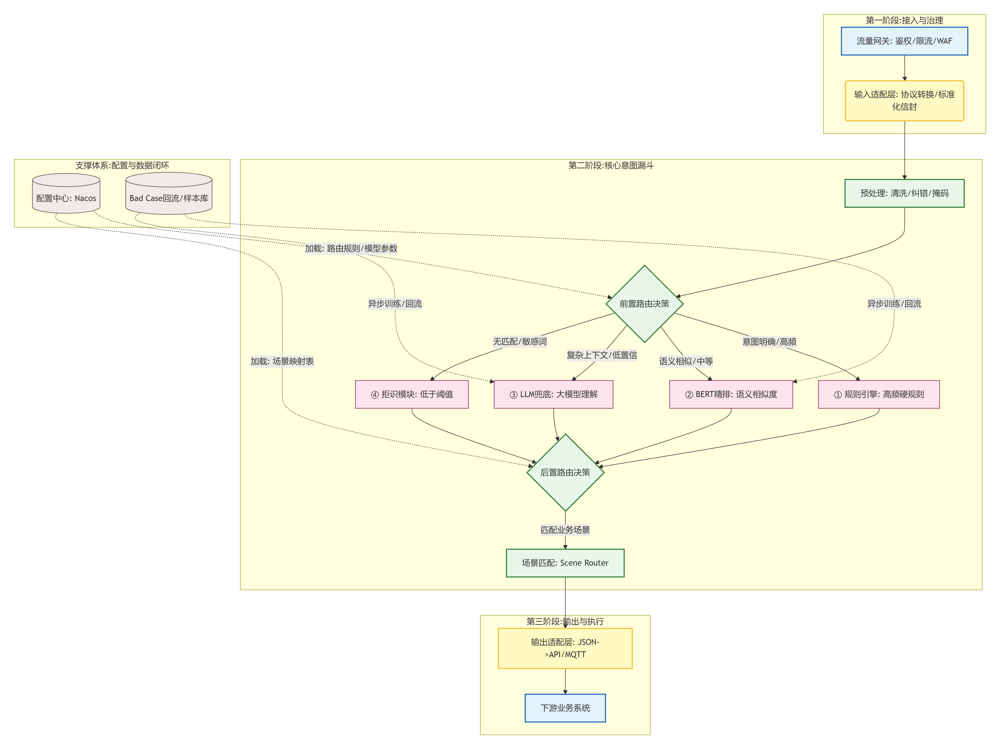
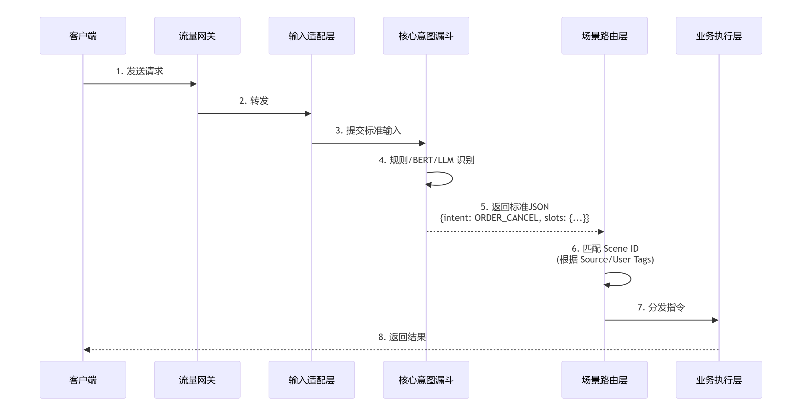

# Intent Hub 意图中枢

Intent Hub 是一个面向企业业务系统的意图识别与路由中枢。它不是单纯的 NLU 服务，而是把输入接入、意图识别、双阶段路由、受控 LLM 兜底、下游动作适配、配置治理、审计追踪和 bad case 回流放在同一套工程闭环中管理。

当前项目已完成 P1 最小识别闭环并进入 P2 试点扩展：已具备可编译、可启动、可测试的识别主链路，并完成 PostgreSQL/Flyway 持久化、Admin 配置治理 API、已发布配置读取、可观测查询 API、P2-1 动态 scene 读取、P2-2 Bad Case 标注/导出、P2-3 最小指标采集、P2-4 模型服务适配和 P2-5 受控 LLM 兜底闭环。

## 快速导航

- [核心原则](#核心原则)
- [总体视图](#总体视图)
- [技术栈](#技术栈)
- [模块结构](#模块结构)
- [已实现能力](#已实现能力)
- [本地运行](#本地运行)
- [当前进度](#当前进度)
- [关键文档](#关键文档)

推荐先阅读 HTML 总览：[IntentHub 生命周期规划阅读版](docs/codex/v1/intent-hub-lifecycle.html)，再按需查看 [P0 契约与 Schema](docs/codex/v1/designs/intent-hub-p0-contract-schema-design.md)、[P1 最小闭环设计](docs/codex/v1/designs/intent-hub-p1-minimal-loop-design.md)、[P2-1 动态 scene 读取审查](docs/codex/v1/trace/intent-hub-p2-dynamic-scene-routing-trace.md)、[P2-2 Bad Case 标注流转审查](docs/codex/v1/trace/intent-hub-p2-bad-case-workflow-trace.md)、[P2-3 指标观测审查](docs/codex/v1/trace/intent-hub-p2-metrics-observability-trace.md)、[P2-4 模型服务适配审查](docs/codex/v1/trace/intent-hub-p2-model-service-adapter-trace.md) 和 [P2-5 LLM 受控兜底审查](docs/codex/v1/trace/intent-hub-p2-llm-governance-trace.md)。

## 核心原则

### 双阶段路由

先选“怎么认”，再选“谁来干”。

- 前置路由：根据租户、来源、渠道、场景等信息选择识别策略、规则集、模型策略和 LLM 兜底策略。
- 后置路由：在意图、槽位、置信度和风险条件明确后，再选择下游动作，例如 API、MQ、Webhook、MQTT。

### LLM 受控

LLM 是最后一道防线，不是主力识别路径。

- P1 默认以规则识别为主。
- LLM 通过 Spring AI 抽象接入，默认实现预留 Spring AI Alibaba。
- LLM 触发必须受策略控制，包括开关、预算、超时、重试、fallback decision 和审计。

### 防腐层

输出适配层只发指令，不碰业务数据。

- 下游动作只表达“调用什么动作”，不携带 SQL、DB 连接串或业务库写入能力。
- P1 允许的动作类型包括 API、MQ、Webhook、MQTT。
- Intent Hub 不成为业务数据孤岛，也不越界成为业务执行系统。

## 总体视图

### 架构图



这张图用于理解系统边界：接入治理、输入适配、前置路由、核心意图漏斗、后置路由、输出适配、配置治理和观测回流。

### 数据流向图 v2



v2 是当前数据流向基线，强调三段式流转：接入与治理、核心意图漏斗、输出与执行。P2-1 动态 scene 读取即落在前置路由与配置读取这一段。

### 核心交互时序



时序图用于区分同步识别和异步执行：识别链路返回标准 `IntentResult`，异步动作通过幂等记录、trace 和 bad case 进入后续运营闭环。

## 技术栈

| 层次 | 选型 |
| --- | --- |
| 语言与框架 | Java 17 + Spring Boot 4.x |
| 工程结构 | Maven 多模块 + DDD 分层 |
| 数据库 | PostgreSQL 16+ |
| Migration | Flyway |
| 缓存与会话 | Redis 7.x，后续接入 |
| 消息队列 | Kafka，后续接入 |
| 配置中心 | Nacos 3.x，后续用于服务发现和运行时配置分发 |
| LLM 接入 | Spring AI 抽象，P1 默认预留 Spring AI Alibaba Adapter |
| 可观测 | OpenTelemetry + Prometheus + Grafana + Loki/ELK，后续完善 |

## 模块结构

```text
intent-hub-parent
├── intent-hub-domain          # 领域层：核心识别、配置、会话、策略抽象
├── intent-hub-application     # 应用层：用例编排、端口定义、配置治理服务
├── intent-hub-infrastructure  # 基础设施层：JDBC、Flyway、LLM Adapter、内存/JDBC 适配器
├── intent-hub-interfaces      # 接口层：REST API、Admin API、启动类
├── docs                       # 需求、设计、计划、评审与 HTML 阅读版
└── scripts                    # 本地环境检查脚本
```

依赖方向约束：

- `intent-hub-domain` 不依赖 Spring Web、DB、Redis、Kafka、Spring AI Alibaba。
- `intent-hub-application` 只依赖领域模型和端口。
- `intent-hub-infrastructure` 实现持久化、LLM、外部系统等端口。
- `intent-hub-interfaces` 只做 HTTP 入参出参转换和启动装配。

## 已实现能力

### 识别闭环

- `POST /api/v1/intent/recognize`
- Envelope 输入契约
- IntentResult 输出契约
- `SUCCESS`、`CLARIFY`、`REJECTED`、`HANDOFF`、`BLOCKED`、`ASYNC_ACCEPTED` 决策枚举
- 轻量规则识别
- 前置路由和后置路由
- 缺槽澄清
- 异步动作幂等键
- trace、bad case、idempotency 内存与 JDBC 记录
- `local-jdbc` 模式下支持按 Envelope `metadata.scene_id` / `metadata.sceneId` 显式选择已发布 scene；未指定时读取租户最新 `PUBLISHED` scene；未命中时回退内置 `order-scene`

### 配置治理

- `POST /api/v1/admin/config/versions`：创建配置草稿
- `GET /api/v1/admin/config/versions/{version}`：查询配置版本
- `POST /api/v1/admin/config/versions/{version}/validate`：校验配置
- `POST /api/v1/admin/config/versions/{version}/publish`：发布配置
- `POST /api/v1/admin/config/versions/{version}/rollback`：回滚配置
- `GET /api/v1/admin/config/versions/{version}/export`：导出配置
- `POST /api/v1/admin/config/versions/import`：导入配置
- `POST /api/v1/admin/config/versions/{version}/{objectType}`：新增或更新配置对象
- `GET /api/v1/admin/config/versions/{version}/{objectType}`：查询配置对象列表

`objectType` 支持：

- `intents`
- `slots`
- `synonyms`
- `strategies`
- `routes`
- `downstream-actions`

配置对象编辑仅允许发生在 `DRAFT` 版本，已发布版本通过发布/回滚控制线上生效。

### 可观测查询

- `GET /api/v1/admin/observability/traces/{traceId}`：按 `trace_id` 查询识别路径、决策、槽位、下游动作和输入快照。
- `GET /api/v1/admin/observability/bad-cases`：按租户、场景、意图、状态和 limit 查询 bad case。
- `POST /api/v1/admin/observability/bad-cases/{traceId}/annotate`：标注 bad case，写入修正意图与备注，状态变为 `ANNOTATED`。
- `POST /api/v1/admin/observability/bad-cases/{traceId}/close`：关闭 bad case，状态变为 `CLOSED`。
- `GET /api/v1/admin/observability/bad-cases/export`：导出训练样本格式，可选择导出后标记为 `EXPORTED`。
- `GET /api/v1/admin/metrics`：查询最小指标 JSON 快照。
- `GET /api/v1/admin/metrics/prometheus`：导出 Prometheus 文本格式指标。

示例：

```bash
curl "http://localhost:8080/api/v1/admin/observability/traces/TRACE-001"
curl "http://localhost:8080/api/v1/admin/observability/bad-cases?tenantId=demo&status=OPEN&limit=20"
curl -X POST "http://localhost:8080/api/v1/admin/observability/bad-cases/TRACE-001/annotate" \
  -H "Content-Type: application/json" \
  -d '{"correctedIntentCode":"ORDER_QUERY","note":"人工修正为订单查询","actor":"reviewer"}'
curl "http://localhost:8080/api/v1/admin/observability/bad-cases/export?tenantId=demo&sceneId=order-scene&status=ANNOTATED&markExported=true"
curl "http://localhost:8080/api/v1/admin/metrics"
curl "http://localhost:8080/api/v1/admin/metrics/prometheus"
```

P2-2 当前采用最小流转：复用 `bad_case.status` 表达 `OPEN`、`ANNOTATED`、`CLOSED`、`EXPORTED`，暂不新增独立标注表；JDBC 标注会用现有 `intent_code` 和 `reason` 字段承载修正意图与备注，后续 P2.x 再扩展为完整标注历史和审核流。

P2-3 当前采用最小指标闭环：不引入 Actuator/Micrometer，不改变 `/api/v1/admin/health` 口径；先通过应用层 `IntentMetricsPort` 与内存实现记录请求量、decision、intent、scene、bad case 候选数、模型 fallback、LLM fallback、LLM 预算消费尝试和耗时统计，后续再替换或桥接到 OpenTelemetry/Micrometer。

P2-4 当前采用最小模型服务适配：新增 `ModelClientPort` 和 `ModelRecognitionPolicy`，识别顺序为 Rule -> Model -> LLM；默认 `intent-hub.model-service.enabled=false`，无 `base-url` 时 no-op，不影响规则主链路。HTTP adapter 按 FastAPI 风格调用 `POST {baseUrl}/recognize`，并通过 `GET {baseUrl}/health` 接入 Admin 健康检查；模型服务异常会记录 `MODEL_FALLBACK:CLOSED` 并失败关闭，不打断识别链路。当前已新增 [FastAPI 模型服务示例](examples/model-service-fastapi/README.md)。

P2-5 当前采用受控 LLM 兜底：新增 `intent-hub.llm.*` 全局治理开关，并从已发布 `nlu_strategy.llm_policy` 读取 scene 级策略。只有全局开关、endpoint、预算、策略开关、策略预算和超时同时满足时，`TongyiLlmAdapter` 才会尝试外呼；当 provider 为 `spring-ai-alibaba` 且存在 `ChatClient.Builder` 时优先走 Spring AI Alibaba `ChatClient`，否则保留 HTTP 契约 fallback 调用 `POST {baseUrl}/recognize`。调用失败会在识别路径中记录 `LLM_FALLBACK:{fallbackDecision}` 并失败关闭，不影响规则和模型链路。当前已在真实外呼前执行日预算原子预占门禁，并通过 `llm_budget_usage` 持久化审计与 `GET /api/v1/admin/llm/budget-usage` 暴露管理端查询；查询同时返回 confirmed 明细用量、reserved 预占用量和 pending 预占差额；同步外呼失败会释放本次预占。后台补偿最小能力已通过 `intent-hub.llm.budget-reconciliation.*` 接入，默认关闭，开启后会把 stale pending 预占校正到 confirmed 用量；告警和真实多实例压测仍作为 P2.x 增强。

### 持久化

Flyway 已落地 P1 必需表：

- `config_version`
- `intent_definition`
- `slot_definition`
- `synonym_mapping`
- `nlu_strategy`
- `scene_routing_rule`
- `downstream_action`
- `recognition_trace`
- `bad_case`
- `idempotency_record`
- `audit_log`

## 本地运行

### 环境要求

- JDK 17+
- Maven 3.9+
- 可选：Docker，用于本地 PostgreSQL 联调

Windows 环境可先执行检查脚本：

```powershell
powershell -ExecutionPolicy Bypass -File scripts/check-p1-env.ps1
```

### 构建与测试

```bash
mvn test
mvn clean package
```

当前验证结果：`mvn test` 通过，全量共 61 个测试；`mvn package -DskipTests` 通过。

### 启动默认内存模式

```bash
java -jar intent-hub-interfaces/target/intent-hub-interfaces-0.1.0-SNAPSHOT.jar
```

健康检查：

```bash
curl http://localhost:8080/api/v1/admin/health
```

当前项目暴露的是 `/api/v1/admin/health`，未暴露 `/actuator/health`。

响应会包含核心服务状态和模型服务健康状态，例如：

```json
{
  "status": "UP",
  "scope": "p1-minimal-loop",
  "model_service": {
    "healthy": false
  }
}
```

### 识别请求示例

```bash
curl -X POST http://localhost:8080/api/v1/intent/recognize \
  -H "Content-Type: application/json" \
  -d '{
    "tenantId": "demo",
    "source": "app",
    "channel": "chat",
    "inputType": "TEXT",
    "text": "取消订单 O20260601001",
    "requestId": "REQ-001"
  }'
```

预期核心结果：

```json
{
  "intentCode": "ORDER_CANCEL",
  "decision": "ASYNC_ACCEPTED",
  "idempotencyKey": "..."
}
```

### PostgreSQL 本地联调

启动 PostgreSQL 示例：

```bash
docker run --name intent-hub-postgres \
  -e POSTGRES_DB=intent_hub \
  -e POSTGRES_USER=intent_hub \
  -e POSTGRES_PASSWORD=intent_hub \
  -p 5432:5432 \
  -d postgres:16-alpine
```

使用 JDBC profile 启动：

```bash
java -jar intent-hub-interfaces/target/intent-hub-interfaces-0.1.0-SNAPSHOT.jar \
  --spring.profiles.active=local-jdbc
```

`local-jdbc` 会连接 `localhost:5432/intent_hub`，并启用 Flyway migration。

### DashScope 沙箱冒烟准备

DashScope 冒烟只通过环境变量读取密钥，仓库不保存任何明文凭证。该链路仍受 `intent-hub.llm.*` 全局治理和已发布 scene 级 `llmPolicy` 双重约束，LLM 只作为 Rule -> Model 之后的最后兜底。

启动服务：

```powershell
$env:DASHSCOPE_API_KEY="<your-dashscope-api-key>"
$env:DASHSCOPE_CHAT_MODEL="qwen-plus"
java -jar intent-hub-interfaces/target/intent-hub-interfaces-0.1.0-SNAPSHOT.jar --spring.profiles.active=dashscope-smoke
```

另开终端执行冒烟脚本：

```powershell
.\scripts\dashscope-smoke.ps1 -BaseUrl "http://localhost:8080"
```

脚本会自动创建并发布 `dashscope-smoke-scene`，写入 `provider=spring-ai-alibaba` 的 `llmPolicy`，发送一条规则/模型不命中的识别请求，并输出 `traceId`、`decision`、`intentCode`、`recognitionPath` 和 LLM 预算消费指标。

## 当前进度

- P0 契约与 DB Schema 已评审通过。
- 技术选型已确认。
- DDD/Maven 多模块骨架已落地。
- P1-1 工程可编译、本地可启动已完成。
- P1-2 自动化验收已完成。
- P1-3 PostgreSQL/Flyway 持久化真实联调已完成。
- P1-4 Admin 配置版本生命周期 API 已完成，并通过 JDBC 联调。
- P1-4 配置对象最小 Upsert/List API 已完成，并通过默认 memory 模式 HTTP 冒烟。
- P1-4 识别链路读取 PostgreSQL 最新 `PUBLISHED` 配置已完成，并通过 `local-jdbc` 冒烟。
- P1-5 可观测查询 API 已完成，并通过默认 memory 与 `local-jdbc` 冒烟。
- P1-6 退出评审已完成，结论为有条件通过，可进入 P2 规划与试点扩展。
- P2-1 动态 scene 读取最小闭环已完成：JDBC 已发布配置读取不再固定 `order-scene`，支持 metadata 指定 scene、租户最新发布 scene 兜底和内置配置最终回退。
- P2-2 Bad Case 标注流转与样本导出最小闭环已完成：支持标注、关闭、导出训练样本和导出后标记，memory/JDBC 双实现均已接入应用端口。
- P2-3 最小指标采集闭环已完成：支持识别链路指标采集、Admin JSON 快照和 Prometheus 文本导出。
- P2-4 模型服务适配最小闭环已完成：模型候选位于规则之后、LLM 之前，默认关闭/no-op，支持 FastAPI 风格 HTTP adapter。
- P2-5 受控 LLM 兜底最小闭环已完成：LLM 仍是最后一道防线，支持全局治理配置、scene 策略读取、预算/超时门禁、有限重试和 fallback 失败关闭。

P1-4 JDBC 联调结果：

- 创建 `v-jdbc-1`、`v-jdbc-2` 草稿。
- 完成校验、发布、发布新版本、回滚和导出。
- 数据库终态：`v-jdbc-1=PUBLISHED`、`v-jdbc-2=ARCHIVED`。
- 审计结果：`audit_log_count=6`。

P1-5 可观测联调结果：

- 默认 memory 模式：`TRACE-OBS-SMOKE-003` 可查询到 `ORDER_QUERY/SUCCESS`，路径包含 `POST_ROUTE:ORDER_QUERY_SYNC`。
- `local-jdbc` 模式：`TRACE-JDBC-OBS-003` 可从 PostgreSQL 查询到 `INVOICE_QUERY/SUCCESS`，路径包含 `PRE_ROUTE:order-scene:v-published-read-1` 与 `POST_ROUTE:INVOICE_QUERY_API`。
- bad case 查询支持 `tenantId`、`sceneId`、`intentCode`、`status` 和 `limit` 过滤，已验证 `tenantId=demo&status=OPEN` 可返回拒识样本。

P2-1 动态 scene 验证结果：

- 新增 `JdbcSceneConfigRepositoryTest` 覆盖 `metadata.scene_id=invoice-scene` 时读取 `invoice-scene/v-invoice`。
- 未指定 metadata scene 时，读取当前租户最新 `PUBLISHED` scene。
- 指定 scene 无发布版本时，回退 P1 内置 `order-scene/v1-p1`，保持历史兼容。

P2-2 Bad Case 流转验证结果：

- 新增 `BadCaseWorkflowAppService` 与 `BadCaseWorkflowPort`，将写操作与只读观测查询分离。
- 新增 Admin API 覆盖 annotate、close、export，并通过接口层契约测试。
- memory repository 已验证 `OPEN -> ANNOTATED -> EXPORTED -> CLOSED` 最小状态流转。
- `mvn test` 通过，共 24 个测试。

P2-3 指标采集验证结果：

- 新增 `IntentMetricsPort`、`MetricsAppService`、`MetricsSnapshot`。
- 新增 `InMemoryIntentMetricsRepository`，识别链路自动记录请求总数、bad case 候选、模型 fallback、LLM fallback、LLM 预算消费尝试、decision、intent、scene 和耗时。
- 新增 `GET /api/v1/admin/metrics` 与 `GET /api/v1/admin/metrics/prometheus`。
- `mvn test` 通过，共 26 个测试。

P2-4 模型服务适配验证结果：

- 新增 `ModelClientPort`、`ModelRecognitionPolicy`、`HttpModelClientAdapter`、`NoopModelClientAdapter`。
- `RecognizeAppService` 策略顺序调整为 Rule -> Model -> LLM，LLM 仍是最后一道防线。
- 默认配置关闭模型服务：`intent-hub.model-service.enabled=false`。
- `GET /api/v1/admin/health` 已追加 `model_service.healthy`，开启模型服务时通过 `GET {baseUrl}/health` 查询远端状态。
- 模型服务异常时记录 `MODEL_FALLBACK:CLOSED`，继续进入后续 LLM 或拒识路径。
- `ModelClientAdapterTest` 已通过 JDK 本地 HTTP server 覆盖真实 POST/JSON 解析冒烟。
- 已使用 `examples/model-service-fastapi` 启动本地 FastAPI 服务完成真实联调：Admin health 返回 `model_service.healthy=true`，`cancel A100` 识别路径包含 `ModelRecognitionPolicy`。
- `mvn test` 通过，共 29 个测试。

P2-5 LLM 受控兜底验证结果：

- 新增 `LlmGovernanceProperties` 与 `TongyiLlmAdapter`，默认 `intent-hub.llm.enabled=false` 且 `daily-budget=0.0`。
- `JdbcSceneConfigRepository` 已从已发布 `nlu_strategy.llm_policy` 读取 `enabled/provider/model/timeoutMs/maxRetries/dailyBudget/fallbackDecision`。
- 应用层已验证 LLM provider 异常时失败关闭并记录 `LLM_FALLBACK:REJECTED`。
- 基础设施层已验证治理关闭、策略预算为 0、日预算耗尽、全局预算收紧、成功返回候选、有限重试后失败、远端失败后释放本次预占，以及 memory/JDBC 日预算预占不双算、可暴露 pending 差额、失败释放后可再次预占、后台补偿 stale pending 预占等场景。
- 模型服务和 LLM HTTP adapter 已通过 `SimpleClientHttpRequestFactory` 绑定 connect/read timeout。
- LLM adapter 仅在真实外呼尝试前记录预算消费，治理关闭或 scene 预算为 0 时不记账。
- 已新增 LLM 预算审计端口和 `llm_budget_usage` 持久化表，按 tenant、scene、日期、provider、model 记录外呼尝试次数和消费单位；`TongyiLlmAdapter` 会在外呼前读取当日用量，达到全局预算与 scene 预算较小值时直接返回空候选；管理端可通过 `GET /api/v1/admin/llm/budget-usage?tenantId=...&sceneId=...&usageDate=YYYY-MM-DD` 查询用量。
- `TongyiLlmAdapter` 已预接入 Spring AI Alibaba `ChatClient` 分支，并保留 HTTP 契约 fallback。
- 新增 `dashscope-smoke` profile 与 `scripts/dashscope-smoke.ps1`，真实沙箱冒烟所需的配置模板、凭证注入方式和验证步骤已准备好；真实外呼需运行时提供 `DASHSCOPE_API_KEY`。
- `mvn test` 通过，全量共 61 个测试；`mvn package -DskipTests` 通过。

## 下一步

- P2.x：补更完整的模型服务样本、阈值、版本策略和部署化联调；FastAPI 示例工程、adapter 本地 HTTP server 冒烟、健康检查和本地真实联调已覆盖。
- P2.x：已完成 LLM adapter 的 Spring AI Alibaba `ChatClient` 预接入、DashScope 沙箱冒烟脚本准备、日预算原子预占门禁、管理端 confirmed/reserved/pending 查询、同步失败释放和默认关闭的 stale pending 后台补偿；下一步在提供沙箱凭证后补真实 trace/metrics/bad case 证据，并补告警与真实多实例压测。
- P2.x：将当前最小指标端口桥接 Micrometer/OpenTelemetry，补 Grafana 看板和基础告警。
- P2.x：补 Bad Case 独立标注历史表、批量导入导出、审核状态和训练任务联动。

## 关键文档

| 文档 | 用途 |
| --- | --- |
| [总体状态](docs/codex/v1/status.md) | 当前阶段、交付物索引和变更记录 |
| [需求文档](docs/codex/v1/requirements/intent-hub-requirements.md) | 业务目标、边界、核心需求和验收口径 |
| [总体设计](docs/codex/v1/designs/intent-hub-design.md) | 整体架构、技术方案、服务规划和关键约束 |
| [P0 契约与 Schema](docs/codex/v1/designs/intent-hub-p0-contract-schema-design.md) | Envelope、IntentResult、DB Schema、双阶段路由和防腐层契约 |
| [P1 最小闭环设计](docs/codex/v1/designs/intent-hub-p1-minimal-loop-design.md) | P1 工程结构、识别闭环、配置治理、持久化和观测查询 |
| [P1 下一步计划](docs/codex/v1/plans/intent-hub-p1-next-step-plan.md) | P1 执行拆分、验证顺序和退出标准 |
| [P1 退出评审](docs/codex/v1/trace/intent-hub-p1-exit-review.md) | P1 有条件通过结论、遗留风险和 P2 准入建议 |
| [P2-1 动态 scene 读取审查](docs/codex/v1/trace/intent-hub-p2-dynamic-scene-routing-trace.md) | 动态 scene 读取实现结果、验证证据和剩余风险 |
| [P2-2 Bad Case 标注流转审查](docs/codex/v1/trace/intent-hub-p2-bad-case-workflow-trace.md) | Bad Case 标注、关闭、导出训练样本的实现结果、验证证据和剩余风险 |
| [P2-3 指标观测审查](docs/codex/v1/trace/intent-hub-p2-metrics-observability-trace.md) | 最小指标采集、JSON 快照和 Prometheus 文本导出的实现结果与剩余风险 |
| [P2-4 模型服务适配审查](docs/codex/v1/trace/intent-hub-p2-model-service-adapter-trace.md) | FastAPI 风格模型服务 adapter、策略顺序、健康检查和默认关闭边界 |
| [P2-5 LLM 受控兜底审查](docs/codex/v1/trace/intent-hub-p2-llm-governance-trace.md) | LLM 全局治理、scene 策略读取、日预算原子预占、管理端查询、有限重试和 fallback 失败关闭 |
| [HTML 阅读版](docs/codex/v1/intent-hub-lifecycle.html) | 面向阅读的全生命周期规划页 |

## 原始设计资料

| 资料 | 说明 |
| --- | --- |
| [README 展示图目录](docs/assets/architecture/) | GitHub README 使用的稳定英文文件名图片副本 |
| [意图中枢架构图](docs/codex/v1/designs/意图中枢架构图.png) | 当前架构边界参考图 |
| [数据流向图 v2](docs/codex/v1/designs/数据流向图v2.png) | 当前数据流向基线 |
| [核心交互时序图](docs/codex/v1/designs/核心交互时序图.png) | 同步识别与异步执行参考 |
| [原始需求说明](docs/codex/v1/designs/意图中枢需求说明.md) | 初始需求资料 |
